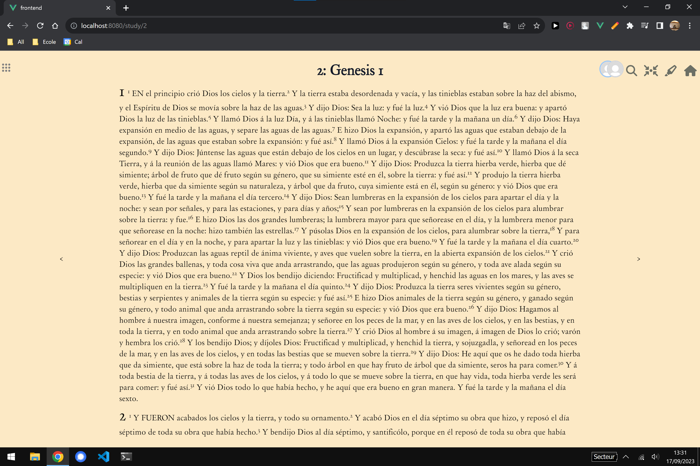

# Bible App

## In development
This is a personal project that i'm currently developping.
Any contribution is welcome after i finish the first version

for now here is a screenshot of what i did. It's not much but more is comming (i'm in vacation so i can code everyday)

## Objective
The Bible app is an app that allows you to study the bible by highlithing paragaphs and write text associated.

## Functionalities
- Highlight text
- Write text associated with a region highlighted
- Have different highliting colors 
- Show text you wrote when overing words
- Saving everything in a database
- Sync functionalities 
